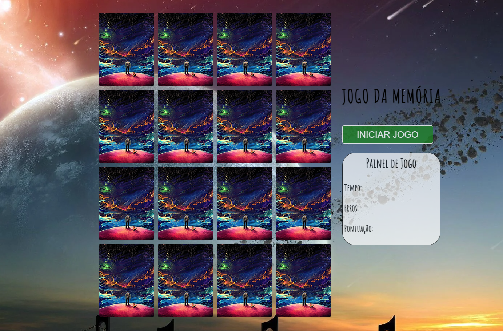

# JOGO DA MEMÓRIA - Mecânica Exclusiva

- Sistema para embaralhar;
- Sistema de Pontuação;
- Sistema de Cronômetro em tempo real (front-end);
- Sistema pronto para inserção de checkbox para escolha de quantidade de cartas;
- Sistema de início e finalização de jogo;
- Código comentado para facilitar manutenção.

