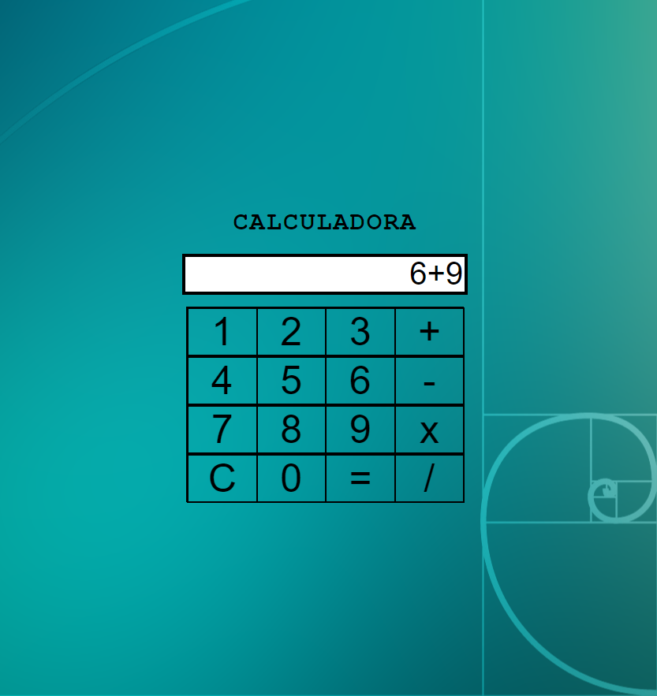

# Calculadora com JS + CSS

**Recursos:**

- Cálculos com manipulação de DOM via JS;
- Efeitos de transição em CSS;
- Utilização de addEventListener;
- Função de conversão de string para finalidade de cálculo, de forma a evitar o módulo eval(), por questões de segurança.

A função que atribui o valor ao visor está pronta, de forma que outros botões e funções podem ser acrescidas sem a necessidade de ficar alterando a função de cálculo central.

