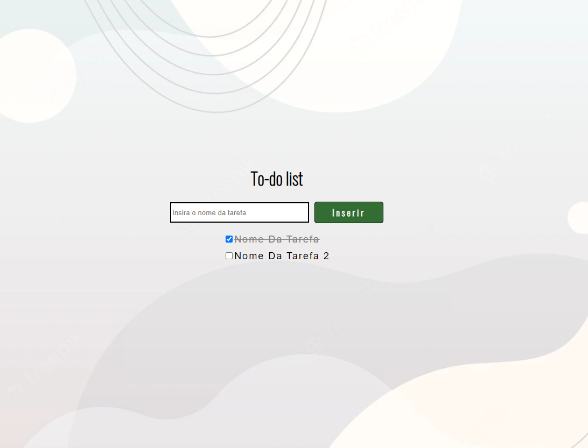

# Criação de um checklist com JS e HTML

**Recursos:**

- Inserção de tarefas com manipulação de DOM via JS;
- Efeitos de transição em CSS;
- Utilização de recursos da biblioteca JQuery;
- Text-Transform para tarefas concluídas.

Cada tarefa possui um id único, criado através da variável checkboxId. Dessa forma, caso seja necessário, o usuário pode alterar o comportamento de cada tarefa de forma prática e isolada.

